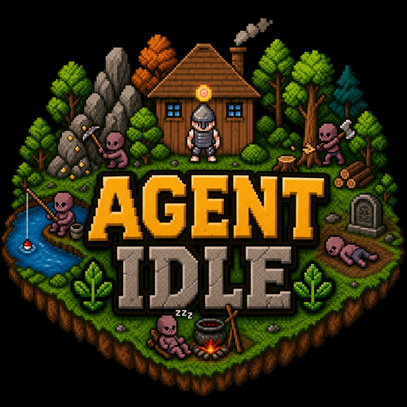
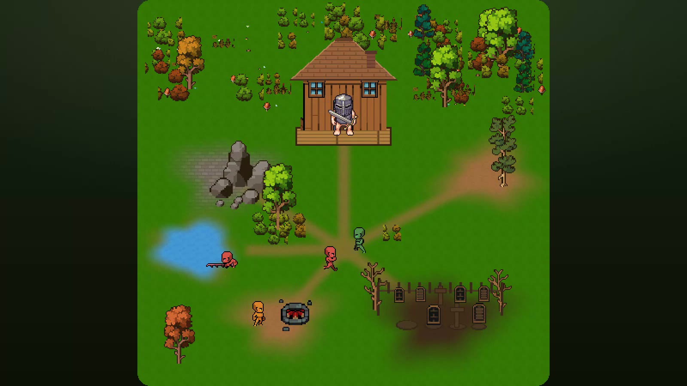

<div align="center">



# Agent Idle

**Your coding agent is a pixel pet that works for you — and brings home tokens.**

[](https://agent-idle.com)
[](https://www.npmjs.com/package/agent-idle)
[](https://github.com/apeeling-ai/agent-idle/actions/workflows/ci.yml)
[](LICENSE)

<a href="https://agent-idle.com"></a>

</div>

Your pet lives on your second monitor and labors away in real time: when your agent runs a
shell command, the pet **mines**. When it edits a file, it's at the **forge**. When it's
reading, it's in the **grove**. When it needs you, a `?` pops over its head. When a turn
errors, it gets knocked out — and gets back up on the next one.

It's not a progress bar. It's a 16×16 mirror of your Tuesday — a hard-working little pet
whose labor you can watch out of the corner of your eye.

The **tokens** your pet brings home are the yield: they mint coins, climb an unbounded
level badge, dress it in **visible cosmetic armor**, and rank it on a **leaderboard you
can't fake**. (Prompt quality seasons its *mood* — a gourmet prompt vs. a lazy *"make it
pop"* that leaves it Confused — but tokens are what it works for.) Pets you can keep:
**Claude Code** and **Codex**.

## Get started in 30 seconds

```bash
npx agent-idle setup
```

That's it — pick your agent(s), sign in via the browser, and go back to work. The sensor
daemon starts itself the first time a hook fires; you never launch anything by hand. Watch
your pet earn its keep at **[agent-idle.com](https://agent-idle.com)**, or grab the desktop
app from the [latest release](https://github.com/apeeling-ai/agent-idle/releases/latest)
for the ambient always-on-top window.

| Your agent is… | …and the pet is… |
|---|---|
| running a shell command | **mining** at a boulder |
| editing a file | at the **forge** (sawmill / chopping) |
| reading or gathering | in the **grove** |
| waiting on a permission | flagging a **`!`** bubble |
| idle, waiting on you | a **`?`** bubble |
| a turn that errored | **knocked out** (up again next turn) |
| session ended | **fainting** |

No labels needed — you read your pet's workday out of the corner of your eye.

> ### Privacy is architecture, not a policy.
> Your prompts and source code **never leave your machine**. The sensor appraises prompts
> *locally* and ships only a coarse numeric quality score and a few counts. There is no
> prompt-text or source-code column anywhere in the backend — by design, not by promise. →
> **[PRIVACY.md](PRIVACY.md)**

## Built to be honest

A leaderboard you can lie to is worthless. Three decisions make cheating structurally hard:

1. **One pure engine, three runtimes.** [`packages/engine`](packages/engine) is a headless
   reducer with no DOM, no Node, no network — and **CI fails the build the instant anything
   imports one**. The *same math* runs in the Convex backend, the CLI daemon, and the app,
   so a pet behaves identically on every machine you're signed into.
2. **The server is the only writer.** Clients never write totals. They emit events; the
   server dedups by id, appends to an immutable ledger, and reduces it with the engine.
   Your score is *derived from facts*, not asserted by your client.
3. **Privacy is structural.** Prompts are appraised locally; only a single coarse quality
   number ever leaves your machine — and because that number isn't server-verifiable, it's
   **excluded from the competitive score** by default. It drives the pet's mood, not your rank.

And there's **no tick** — liveness is pure math over elapsed time, computed at read:
`lively → weary → drained → fainted → dead → gone`, each rung a time threshold past your
last real work. Your pet can faint while the server sleeps and still be correct the instant
you look. ("Lazy decay.")

## Hacking on it

```
agent-idle/
├── packages/engine/   # the brain — pure TS reducer. No DOM/Node/fetch. Fully unit-tested.
├── convex/            # authority: canonical state + realtime sync + Convex Auth
├── apps/app/          # Tauri (React + Vite + PixiJS): UI, renderer, compositor
├── apps/cli/          # agent-idle CLI: setup, remove, headless sensor daemon
├── sprites/           # game art — third-party packs, see ATTRIBUTION.md for licenses
└── scripts/           # engine-purity guardrail + asset bake scripts
```

You'll need **Node ≥ 22** (`nvm use 22`) and **pnpm**. Rust/Tauri is only required for the
native desktop window — the web frontend builds without it. Convex runs a **local**
deployment for dev; no cloud account required.

```bash
pnpm install
pnpm dev             # everything at once: convex dev + engine watch + CLI watch + app vite
pnpm test            # engine unit tests
pnpm run ci          # engine purity + typechecks + convex typecheck + engine tests
```

`pnpm dev` is the everyday loop: it spins up the local Convex deployment, recompiles the
engine and CLI continuously (so hook changes go live), and serves the app frontend.

<details>
<summary>Why a build step before the CLI? (build order)</summary>

The engine ships as built JS (`packages/engine/dist`) because the CLI runs under plain
Node, which can't import `.ts`. Turbo's `^build` dependency builds the engine before
app/cli for `build`/`typecheck`/`test`/`dev`, so `pnpm dev` and `pnpm build` handle
ordering automatically. `dist/` is gitignored.
</details>

<details>
<summary>Architecture in five bullets</summary>

- **Convex is the authority.** Clients never write totals — they emit events, and
  `convex/events.ts:ingestEvent` validates + reduces them with the engine.
  `getAccountState` is the reactive read every client subscribes to.
- **Auth = Convex Auth** (Password + GitHub OAuth), with per-machine sessions minted
  through an RFC-8628-style device grant — no hand-rolled OAuth anywhere.
- **Lazy decay, no tick.** `engine.decay(snapshot, now)` is a pure function of elapsed
  time, computed at every read. There is *no* scheduled per-entity job.
- **Privacy is structural.** No prompt-text / source-code column exists in any schema.
  The outbox holds numbers only. → [PRIVACY.md](PRIVACY.md)
- **One compositor.** `apps/app/src/render/compositor.ts` is renderer-agnostic;
  `renderer-pixi.ts` is the *only* file that touches Pixi. The same compositor draws the
  live pet, leaderboard avatars, and the share card.

The full deep-dive lives in [CLAUDE.md](CLAUDE.md) and [AGENTS.md](AGENTS.md).
</details>

## Contributing

Contributions are very welcome — start with **[CONTRIBUTING.md](CONTRIBUTING.md)**. The
short version: Node ≥ 22, `pnpm install && pnpm dev`, and `pnpm run ci` must pass. Two
rules are load-bearing: **keep the engine pure**, and **never add prompt-text /
source-code fields to any schema**. Please follow the
[Code of Conduct](CODE_OF_CONDUCT.md); report vulnerabilities per
[SECURITY.md](SECURITY.md).

## License & art

- **Source code** → **[AGPL-3.0-only](LICENSE)**. Run a modified version as a network
  service and you must offer your users the corresponding source.
- **Bundled art & audio keep their own, separate licenses** — *not* under the AGPL. The
  full per-asset breakdown lives in **[ATTRIBUTION.md](ATTRIBUTION.md)**. The world and
  creatures are from the **Pixel Crawler** pack by
  [Anokolisa](https://www.patreon.com/Anokolisa) (deliberately trimmed to just the sheets
  the app uses); the player's gear is
  [Liberated Pixel Cup](https://github.com/liberatedpixelcup/Universal-LPC-Spritesheet-Character-Generator)
  art with per-file credits in [CREDITS.md](CREDITS.md). Buying the packs to support the
  artists is appreciated. 💛

Built by [Apeeling AI](https://apeelingai.com).
